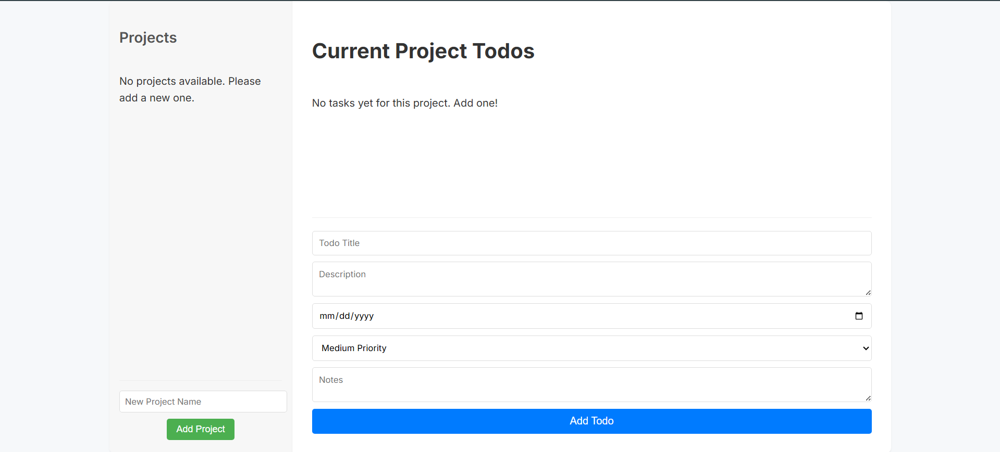

My ToDo List App

A simple and intuitive task management application, built as part of The Odin Project curriculum. It allows users to organize their tasks into different projects, set priorities and due dates, and persist data in the browser for a continuous user experience.

🚀 Features
Comprehensive Project Management:

Create new projects to categorize your tasks.

Rename existing projects with a single click.

Securely delete projects and all their associated tasks.

Select projects to view and manage their specific tasks.

Detailed Task (ToDo) Management:

Add new tasks with title, description, due date, priority (low, medium, high), and notes.

Edit any task detail directly from the interface.

Mark tasks as completed.

Delete individual tasks.

Data Persistence: All your projects and tasks are automatically saved in your browser's localStorage, ensuring your data is preserved between sessions.

Clean User Interface: A minimalist and easy-to-use design, focused on productivity.

🛠️ Technologies Used
HTML5: Semantic structure of the user interface.

CSS3: Custom styles and responsive design.

JavaScript (ES6+): Client-side logic for all application functionality.

Webpack: For modularizing and bundling the JavaScript code, optimizing project organization and performance.

🎯 Getting Started
Follow these steps to get a copy of the project up and running on your local machine.

Prerequisites
You will need a modern web browser (such as Chrome, Firefox, Edge, etc.) to run the application. Node.js and npm/yarn are required if you plan to modify the code and use Webpack for compilation.

Node.js (includes npm)

Installation
Clone the repository:

Bash

git clone https://github.com/al-prieto/todo-list-app.git
Navigate to the project directory:

Bash

cd todo-list-app
Install dependencies (if you plan to develop/build):

Bash

npm install
# or
yarn install
Run the development server (optional, for development):

Bash

npm start
# or
yarn start
This will usually open the application at http://localhost:8080/.

Open index.html directly (for a quick view without a development server):
If you just want to see the application running without using the Webpack development server, simply double-click the index.html file located in the dist/ folder (after compiling with npm run build if you haven't already) or in your project root if your Webpack configuration handles it that way.

💡 Usage
Add a new Project: Use the text field and the "Add Project" button in the left sidebar.

Select a Project: Click on a project name in the sidebar to activate it and view its tasks. The active project will be highlighted.

Add a new Task: With a project selected, fill in the task details in the main section form and click "Add Todo".

View Task Details: Click on a task's title to expand or collapse its description and notes.

Edit Tasks and Projects: Click directly on a project name or the "Edit" button of a task to modify its details.

Delete: Use the "Delete" buttons next to each item to remove specific projects or tasks.

Mark as Completed: Use the checkbox next to each task to toggle its completion status.

📁 Project Structure
.
├── dist/                       # Compiled output files by Webpack (index.html, main.js, styles.css)
├── node_modules/               # Project dependencies installed by npm/yarn
├── src/
│   ├── index.js                # Main application entry point, initializes UI and App modules
│   ├── modules/
│   │   ├── app.js              # Core application logic: managing project and todo collections, localStorage persistence
│   │   ├── project.js          # JavaScript class definition for a Project
│   │   └── todo.js             # JavaScript class definition for a Task (Todo)
│   └── ui/
│       ├── dom.js              # Functions for direct DOM manipulation and rendering UI elements
│       └── ui-controller.js    # UI event handlers for project and task interactions
├── package.json                # Project metadata and npm scripts
├── package-lock.json           # Records exact versions of dependencies
├── webpack.config.js           # Webpack configuration for project compilation
└── README.md                   # This file
🌐 Deployment (GitHub Pages)
This project is configured for easy deployment using GitHub Pages.

Ensure your main branch (main) contains the final code and that compiled files (dist/) are present if your webpack.config.js outputs to that folder.

Navigate to your repository's "Settings" tab on GitHub.

In the sidebar menu, select "Pages".

Under the "Source" section, choose your deployment branch (usually main or gh-pages) and the folder (/root or /docs if your static files are there).

Click "Save".

Your application will be available at the URL provided by GitHub Pages, typically https://al-prieto.github.io/todo-list-app/.

🧑‍💻 Author
Al Prieto

📄 License
This project is licensed under the MIT License. See the LICENSE file (if you include it) for more details.